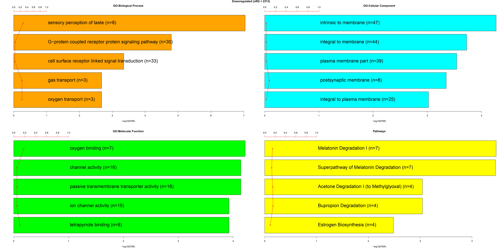

<h2 align="center">  Identification of Smoking-Associated Biomarkers in Stage I Lung Adenocarcinoma through Transcriptomic Profiling and Machine Learning </h2>

<a align="center"> Table of Contents: </a>
  <a href="#Introduction"> Introduction </a> |
  <a href="#Materials-and-Methods"> Materials and Methods </a> | 
  <a href="#Results"> Results </a> | 
  <a href="#Conclusion"> Conclusion </a> |
  <a href="#References"> References </a> |
  <a href="#Contributors"> Contributors </a> 
</a>

## Introduction:
Lung cancer is one of the most common carcinomas in the world and ranks first both in incidence and in mortality (Bray et al., 2024).  Lung adenocarcinoma (LUAD) is the most common subtype of non-small cell lung cancer (NSCLC), and NSCLC accounts for approximately 85% of all lung cancer cases(Gridelli et al., 2015). Smoking is its strongest risk factor and there is a significant and positive correlation between cigarette smoke and lung cancer(Hecht, 1999).
In this study, we aimed to identify potential smoking-associated biomarkers of stage 1 lung Adenocarcinoma based on smoking habits using transcriptomic data and machine learning models. 

## Materials and Methods:
Transcriptome profiling data for lung adenocarcinoma was obtained from the TCGA-LUAD dataset, including 40 samples (20 irregular and 20 regular smokers) of white individuals with stage 1 tumors. Low-expression genes were filtered out. Differential expression analysis between irregular and regular smokers was performed using TCGAbiolinks in R, with criteria of Fdr ≤ 0.01 and logFC ≥ 2. Results were visualized with heatmaps and volcano plots, and enrichment analysis was conducted after mapping ensembl IDs to gene IDs.

ML analysis aimed to identify smoking-associated biomarkers in lung adenocarcinoma. After cleaning and transposing the RNA-seq data, feature selection was done via variance thresholding. The dataset was split into training and test sets, and a Random Forest classifier was tuned using GridSearchCV. Model performance was evaluated with metrics like the confusion matrix, classification report, and ROC-AUC curve. The top 10 important genes were identified, suggesting potential smoking-related biomarkers.

## Results:
Gene expression profiles from TCGA-LUAD were used to compare Regular and Irregular Smokers. RNAseq data revealed several DEGs. The volcano plot (fig.3) showed distinct clustering of Regular and Irregular Smokers. Out of 33,439 genes, 741 were upregulated, and 2,313 were downregulated, and enrichment analysis highlighted gene regulation, transcription, and metabolic homeostasis processes. 

    
     Fig 1: Heatmap of DEGs by Smoking Status

    
     Fig 2: Volcano Plot with Colored Points

    
     Fig 3: TCGAvisualize EAbarplot Output Downregulated Genes

    
     Fig 4: TCGAvisualize EAbarplot Output Upregulated Genes

The ML model was evaluated using a confusion matrix, classification report, accuracy, and ROC curve. It predicted 3 true positives, 4 true negatives, 1 false positive, and 1 false negative, with an overall accuracy of 87.5%. Precision was 100% for irregular smokers and 75% for regular smokers, while the F1-scores were 0.89 and 0.86, respectively. The ROC AUC was 0.93, indicating strong classification performance.

Fig 5: Confusion Matrix 

Fig 6: ROC Curve_Ml 

Fig 7: Top 10 genes in predicting smoking habit from samples_ml 

    
     Fig 8: Average Precision Score

## Conclusion:
This study explored smoking-associated biomarkers in stage I lung adenocarcinoma using transcriptomic profiling and machine learning. We identified 741 upregulated and 2,313 downregulated genes, with enrichment analysis highlighting key pathways like MODY signaling and melatonin degradation. The machine learning model achieved 87.5% accuracy in distinguishing regular and irregular smokers, identifying RGS1, RAB3B, and LINC01551 as top biomarkers. Previous research links Rab3B (Yao et al., 2024) and RGS1 (Wang et al., 2023) to lung adenocarcinoma aggressiveness and prognosis. These findings offer potential biomarkers for early diagnosis, prognosis, and targeted therapy in smoking-related lung cancer, warranting further validation in larger cohorts.

## References:
- Bray, F., Laversanne, M., Sung, H., Ferlay, J., Siegel, R. L., Soerjomataram, I., & Jemal, A. (2024). Global cancer statistics 2022: GLOBOCAN estimates of incidence and mortality worldwide for 36 cancers in 185 countries. CA: A Cancer Journal for Clinicians, 74(3), 229–263. https://doi.org/10.3322/caac.21834
- Gridelli, C., Rossi, A., Carbone, D. P., Guarize, J., Karachaliou, N., Mok, T., Petrella, F., Spaggiari, L., & Rosell, R. (2015). Non-small-cell lung cancer. Nature Reviews Disease Primers, 1(1), 15009. https://doi.org/10.1038/nrdp.2015.9
- Hecht, S. S. (1999). Tobacco Smoke Carcinogens and Lung Cancer. JNCI Journal of the National Cancer Institute, 91(14), 1194–1210. https://doi.org/10.1093/jnci/91.14.1194
- Landi, M. T., Dracheva, T., Rotunno, M., Figueroa, J. D., Liu, H., Dasgupta, A., Mann, F. E., Fukuoka, J., Hames, M., Bergen, A. W., Murphy, S. E., Yang, P., Pesatori, A. C., Consonni, D., Bertazzi, P. A., Wacholder, S., Shih, J. H., Caporaso, N. E., & Jen, J. (2008). Gene expression signature of cigarette smoking and its role in lung adenocarcinoma development and survival. PloS One, 3(2), e1651. https://doi.org/10.1371/journal.pone.0001651
- Liu, Y., Ni, R., Zhang, H., Miao, L., Wang, J., Jia, W., & Wang, Y. (2016). Identification of feature genes for smoking-related lung adenocarcinoma based on gene expression profile data. OncoTargets and Therapy, Volume 9, 7397–7407. https://doi.org/10.2147/OTT.S114230
- Spira, A., Beane, J., Shah, V., Liu, G., Schembri, F., Yang, X., Palma, J., & Brody, J. S. (2004). Effects of cigarette smoke on the human airway epithelial cell transcriptome. Proceedings of the National Academy of Sciences, 101(27), 10143–10148. https://doi.org/10.1073/pnas.0401422101
- Wang, Y., Chen, D., Liu, Y., Shi, D., Duan, C., Li, J., Shi, X., Zhang, Y., Yu, Z., Sun, N., Wang, W., Ma, Y., Xu, X., Otkur, W., Liu, X., Xia, T., Qi, H., Piao, H., & Liu, H. (2023). Multidirectional characterization of cellular composition and spatial architecture in human multiple primary lung cancers. Cell Death and Disease, 14(7). https://doi.org/10.1038/s41419-023-05992-w
- Yao, G., Yu, S., Hou, F., Xiao, Z., Li, G., Ji, X., & Wang, J. (2024). Rab3B enhances the stabilization of DDX6 to promote lung adenocarcinoma aggressiveness. Molecular Medicine, 30(1). https://doi.org/10.1186/s10020-024-00848-1 

## Contributors:
|Name|Slack ID|Linkedin|
| ----------- |----------- |----------- |
|Ayooluwa Joseph|@Jay1079| <a href="https://www.linkedin.com/in/ayooluwa-joseph/" target="_blank">	LinkedIn Profile</a> |
|Edikan Umoh|@usiwomaumoh| <a href="https://www.linkedin.com/in/edikan-umoh/" target="_blank">	LinkedIn Profile</a>|
|Lewis Karani|@Karani|<a href="https://www.linkedin.com/in/lewis-karani/" target="_blank">	LinkedIn Profile</a>|
|Monsurah Bisola Alatise|@AlatiseMB| <a href="https://www.linkedin.com/in/monsurah-bisola-alatise-b58a33225/" target="_blank">	LinkedIn Profile</a> |
|Nishat Tamanna|@Nishat| <a href="https://www.linkedin.com/in/nishat-tamanna-45863117a/" target="_blank">	LinkedIn Profile</a>|
|Shalaka More|@shalaka| <a href="https://www.linkedin.com/in/shalaka-more-03277913b/" target="_blank">	LinkedIn Profile</a>|
|Sreeja Mondal|@sreeja| <a href="https://linkedin.com/in/sreejamondal263/" target="_blank">	LinkedIn Profile</a> |

